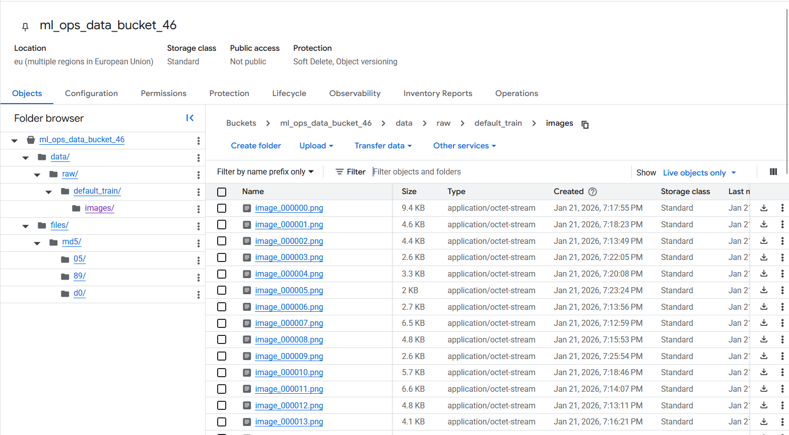
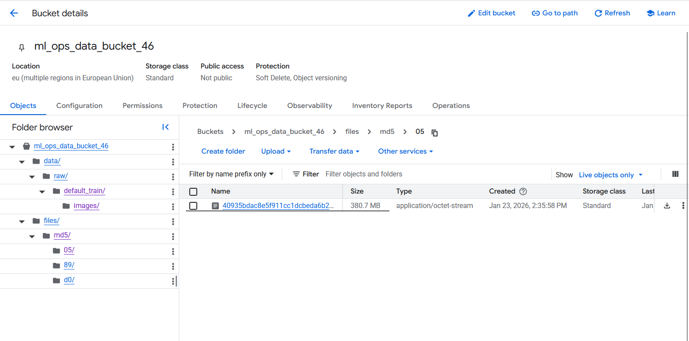
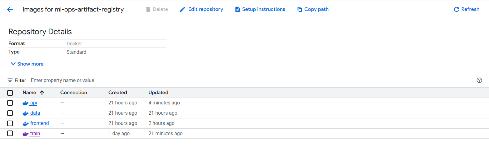

# Exam template for 02476 Machine Learning Operations

This is the report template for the exam. Please only remove the text formatted as with three dashes in front and behind
like:

```--- question 1 fill here ---```

Where you instead should add your answers. Any other changes may have unwanted consequences when your report is
auto-generated at the end of the course. For questions where you are asked to include images, start by adding the image
to the `figures` subfolder (please only use `.png`, `.jpg` or `.jpeg`) and then add the following code in your answer:

``

In addition to this markdown file, we also provide the `report.py` script that provides two utility functions:

Running:

```bash
python report.py html
```

Will generate a `.html` page of your report. After the deadline for answering this template, we will auto-scrape
everything in this `reports` folder and then use this utility to generate a `.html` page that will be your serve
as your final hand-in.

Running

```bash
python report.py check
```

Will check your answers in this template against the constraints listed for each question e.g. is your answer too
short, too long, or have you included an image when asked. For both functions to work you mustn't rename anything.
The script has two dependencies that can be installed with

```bash
pip install typer markdown
```

or

```bash
uv add typer markdown
```

## Overall project checklist

The checklist is *exhaustive* which means that it includes everything that you could do on the project included in the
curriculum in this course. Therefore, we do not expect at all that you have checked all boxes at the end of the project.
The parenthesis at the end indicates what module the bullet point is related to. Please be honest in your answers, we
will check the repositories and the code to verify your answers.

### Week 1

* [X] Create a git repository (M5) (Alex)
* [X] Make sure that all team members have write access to the GitHub repository (M5) (Everybody)
* [X] Create a dedicated environment for you project to keep track of your packages (M2) (Everybody)
* [X] Create the initial file structure using cookiecutter with an appropriate template (M6) (Ástríður)
* [X] Fill out the `data.py` file such that it downloads whatever data you need and preprocesses it (if necessary) (M6) (Alex)
* [X] Add a model to `model.py` and a training procedure to `train.py` and get that running (M6) (Andrea and Alessandro)
* [X] Remember to either fill out the `requirements.txt`/`requirements_dev.txt` files or keeping your
    `pyproject.toml`/`uv.lock` up-to-date with whatever dependencies that you are using (M2+M6) (Everybody)
* [X] Remember to comply with good coding practices (`pep8`) while doing the project (M7) (Ástríður and Alex)
* [X] Do a bit of code typing and remember to document essential parts of your code (M7) (Ástríður)
* [X] Setup version control for your data or part of your data (M8) (Alex)
* [X] Add command line interfaces and project commands to your code where it makes sense (M9)
* [X] Construct one or multiple docker files for your code (M10) (Ástríður and Alex)
* [X] Build the docker files locally and make sure they work as intended (M10) (Ástríður and Alex)
* [X] Write one or multiple configurations files for your experiments (M11) (Ástríður)
* [X] Used Hydra to load the configurations and manage your hyperparameters (M11) (Ástríður)
* [ ] Use profiling to optimize your code (M12)
* [X] Use logging to log important events in your code (M14) (Ástríður)
* [ ] Use Weights & Biases to log training progress and other important metrics/artifacts in your code (M14)
* [ ] Consider running a hyperparameter optimization sweep (M14)
* [ ] Use PyTorch-lightning (if applicable) to reduce the amount of boilerplate in your code (M15)

### Week 2

* [X] Write unit tests related to the data part of your code (M16) (Ástríður)
* [X] Write unit tests related to model construction and or model training (M16) (Andrea and Ástríður)
* [X] Calculate the code coverage (M16) (Ástríður)
* [X] Get some continuous integration running on the GitHub repository (M17) (Alex)
* [X] Add caching and multi-os/python/pytorch testing to your continuous integration (M17) (Alex)
* [X] Add a linting step to your continuous integration (M17) (Alex)
* [X] Add pre-commit hooks to your version control setup (M18) (Alex)
* [ ] Add a continues workflow that triggers when data changes (M19)
* [ ] Add a continues workflow that triggers when changes to the model registry is made (M19)
* [X] Create a data storage in GCP Bucket for your data and link this with your data version control setup (M21) (Alex)
* [X] Create a trigger workflow for automatically building your docker images (M21) (Alex)
* [ ] Get your model training in GCP using either the Engine or Vertex AI (M21) (Andrea and Alessandro)
* [X] Create a FastAPI application that can do inference using your model (M22) (Alessandro)
* [x] Deploy your model in GCP using either Functions or Run as the backend (M23) (Alex)
* [X] Write API tests for your application and setup continues integration for these (M24) (Ástríður)
* [X] Load test your application (M24) (Ástríður)
* [ ] Create a more specialized ML-deployment API using either ONNX or BentoML, or both (M25)
* [X] Create a frontend for your API (M26) (Ástríður)

### Week 3

* [X] Check how robust your model is towards data drifting (M27) (Alex)
* [ ] Setup collection of input-output data from your deployed application (M27) (Ástríður)
* [ ] Deploy to the cloud a drift detection API (M27) (Ástríður)
* [x] Instrument your API with a couple of system metrics (M28) (Alessandro)
* [ ] Setup cloud monitoring of your instrumented application (M28)
* [ ] Create one or more alert systems in GCP to alert you if your app is not behaving correctly (M28)
* [ ] If applicable, optimize the performance of your data loading using distributed data loading (M29)
* [ ] If applicable, optimize the performance of your training pipeline by using distributed training (M30)
* [ ] Play around with quantization, compilation and pruning for you trained models to increase inference speed (M31)

### Extra

* [ ] Write some documentation for your application (M32)
* [ ] Publish the documentation to GitHub Pages (M32)
* [ ] Revisit your initial project description. Did the project turn out as you wanted?
* [ ] Create an architectural diagram over your MLOps pipeline
* [ ] Make sure all group members have an understanding about all parts of the project
* [ ] Uploaded all your code to GitHub

## Group information

### Question 1
> **Enter the group number you signed up on <learn.inside.dtu.dk>**
>
> Answer:

Group 46

### Question 2
> **Enter the study number for each member in the group**
>
> Example:
>
> *sXXXXXX, sXXXXXX, sXXXXXX*
>
> Answer:

s242765, s243094, s243139, s243277

### Question 3
> **Did you end up using any open-source frameworks/packages not covered in the course during your project? If so**
> **which did you use and how did they help you complete the project?**
>
> Recommended answer length: 0-200 words.
>
> Example:
> *We used the third-party framework ... in our project. We used functionality ... and functionality ... from the*
> *package to do ... and ... in our project*.
>
> Answer:

The main third-party package that has been used is PIL, which has been used to preprocess the images. The core functionality of PIL in our case has been the possibility to resize the dataset images to a fixed size of 128x640 pixels, which is the size for the ResNet50 model that we used.
Another third-party package that has been used is Matplotlib, which has been used to create visualizations of the learning curves of the model during training.

## Coding environment

> In the following section we are interested in learning more about you local development environment. This includes
> how you managed dependencies, the structure of your code and how you managed code quality.

### Question 4

> **Explain how you managed dependencies in your project? Explain the process a new team member would have to go**
> **through to get an exact copy of your environment.**
>
> Recommended answer length: 100-200 words
>
> Example:
> *We used ... for managing our dependencies. The list of dependencies was auto-generated using ... . To get a*
> *complete copy of our development environment, one would have to run the following commands*
>
> Answer:

We managed all project dependencies using `uv`, which let us keep everything clean and declarative in a single place: `pyproject.toml`. This file defines both our main dependencies and our development tools, so there is no guessing about versions. Whenever we needed a new package, we added it using the command `uv add <package>`. This automatically updated the configuration and made sure special cases were handled correctly. The exact resolved versions are stored in `uv.lock`, so everyone always installs the same dependency versions.

When someone new joins the team, getting the exact same environment is simple. First they install Python 3.11+ and `uv`. Then they can clone the repository and run `uv sync`. This reads the project file, creates a virtual environment if one does not exist yet, and installs the exact versions everyone else is using. No manual `pip install` steps are needed. If they want the same code quality checks, they can also run `uv run pre-commit install` to enable the same Git hooks. After that, their setup matches the rest of the team perfectly.


### Question 5

> **We expect that you initialized your project using the cookiecutter template. Explain the overall structure of your**
> **code. What did you fill out? Did you deviate from the template in some way?**
>
> Recommended answer length: 100-200 words
>
> Example:
> *From the cookiecutter template we have filled out the ... , ... and ... folder. We have removed the ... folder*
> *because we did not use any ... in our project. We have added an ... folder that contains ... for running our*
> *experiments.*
>
> Answer:

We set up our project based on cookiecutter template for MLOps at DTU and mostly stuck to their structure. We mainly filled in the config files in `configs/` using Hydra and set up the complete machine learning pipeline in the `src/ml_ops_project`. This includes modules for data loading, preprocessing, tokenization, model definition, training, evaluation, and a basic FastAPI API stub. We kept out tests in `tests/`, where there was one test for each module, for example, `test_data.py`.

We added Docker support for all stages in `dockerfiles/` (api/data/train and a small frontend image), trained models are kept in `models/`, while data is versioned with DVC through `data.dvc` instead of a versioned `data/` folder. Our CI pipeline in `.github/workflows` is more advanced than the default, including linting, testing, pre-commit auto-updates, and Docker builds. We added `main.py` and `frontend.py` as entry points. In comparison to a basic template, we no longer make use of `notebooks/`, nor emphasize `docs/`, but rather use the exam report in `reports/`.

### Question 6

> **Did you implement any rules for code quality and format? What about typing and documentation? Additionally,**
> **explain with your own words why these concepts matters in larger projects.**
>
> Recommended answer length: 100-200 words.
>
> Example:
> *We used ... for linting and ... for formatting. We also used ... for typing and ... for documentation. These*
> *concepts are important in larger projects because ... . For example, typing ...*
>
> Answer:

We set clear rules for code quality and coding style early on. We used `ruff` for both linting and formatting, to remain the code consistent throughout. The code will be checked automatically in our GitHub Actions pipeline with `ruff check --fix` and `ruff format`, which ensures that the code not following the guidelines will not pass CI. For typing, we used `mypy` to check our static type hints. This made sure we did not have type errors. Finally, we added docstring to all functions and classes.

These were even more important principles as the project increased in size. When multiple developers work on the same codebase, it is much simple to understand if everything is consistent. Linting ensures that minor issues before becoming major bugs can be eliminated, while code style ensures that there is no disagreement about code style. Type hints ensure that programmers understand how data is flowing, while documentation ensures that new programmers can easily join and understand.

## Version control

> In the following section we are interested in how version control was used in your project during development to
> corporate and increase the quality of your code.

### Question 7

> **How many tests did you implement and what are they testing in your code?**
>
> Recommended answer length: 50-100 words.
>
> Example:
> *In total we have implemented X tests. Primarily we are testing ... and ... as these the most critical parts of our*
> *application but also ... .*
>
> Answer:

In total we have implemented 55 tests (53 passed, 2 xfailed), with 83% coverage. We used the coverage report to find lines and functions that had not been tested. We tested not only the "happy paths", but also areas such as images, missing labels, invalid JSON to make sure our error handling actually caught them. By covering these edge cases, we were confident the core components work as expected before they even hit the main training loop.


### Question 8

> **What is the total code coverage (in percentage) of your code? If your code had a code coverage of 100% (or close**
> **to), would you still trust it to be error free? Explain you reasoning.**
>
> Recommended answer length: 100-200 words.
>
> Example:
> *The total code coverage of code is X%, which includes all our source code. We are far from 100% coverage of our **
> *code and even if we were then...*
>
> Answer:

The total code coverage of our code is 83%, which includes all our source code. We are not at 100% coverage because we chose not to include the main entry points and also we did not test on the main train function. However, coverage helped us identify untested error handling branches and edge cases, particularly failing if-statements that we then addressed, and what functions we could have missed.

Even with 100% coverage, we would not trust the code to be entirely error-free. Code coverage only measures whether lines are executed, not whether they are *correct*. There are two major limitations to code coverage: coverage cannot detect logical errors (e.g., an if condition checks the wrong variable), and coverage cannot check code execution for all possible input values. Finally, coverage proves that our tests have seen the code, but it does not guarantee that the code has seen every real-world scenario.

### Question 9

> **Did you workflow include using branches and pull requests? If yes, explain how. If not, explain how branches and**
> **pull request can help improve version control.**
>
> Recommended answer length: 100-200 words.
>
> Example:
> *We made use of both branches and PRs in our project. In our group, each member had an branch that they worked on in*
> *addition to the main branch. To merge code we ...*
>
> Answer:

We heavily relied on branches and pull requests throughout the project. Each feature was implemented in a separate branch named according to the functionality being developed. This branching ensured that our main branch remained stable while we interated on new features in isolation. Before a feature could be merged into the main branch, it has to to pass a series of automated continous integrations.

Before merging a PR to the main branch, it has to undergo review by at least on of the members of the group. This two-step process enforced a peer-review culture where it helped us catch logical mistakes in our code. Also, to further ensure quality before code even reached a PR, we used a `pre-commit-update.yaml` to run local hooks. These local hooks helped us catch any typing or linting mistakes at the local level. Which resulted in a full control of our feature branch code.

### Question 10

> **Did you use DVC for managing data in your project? If yes, then how did it improve your project to have version**
> **control of your data. If no, explain a case where it would be beneficial to have version control of your data.**
>
> Recommended answer length: 100-200 words.
>
> Example:
> *We did make use of DVC in the following way: ... . In the end it helped us in ... for controlling ... part of our*
> *pipeline*
>
> Answer:

--- question 10 fill here --- (Alex)

### Question 11

> **Discuss you continuous integration setup. What kind of continuous integration are you running (unittesting,**
> **linting, etc.)? Do you test multiple operating systems, Python  version etc. Do you make use of caching? Feel free**
> **to insert a link to one of your GitHub actions workflow.**
>
> Recommended answer length: 200-300 words.
>
> Example:
> *We have organized our continuous integration into 3 separate files: one for doing ..., one for running ... testing*
> *and one for running ... . In particular for our ..., we used ... .An example of a triggered workflow can be seen*
> *here: <weblink>*
>
> Answer:

We have set up Continuous Integration (CI) pipeline into five distinct GitHub Actions workflows files, providing a clean separation of concertns and speeding up debugging in the process. This automated test serves as a safety net for every pull request and push operation on our main branch.

Our main test flow (`test.yaml`) supports integration and unit testing across a range of Ubuntu, Windows, and macOS operating systems and uses both Python 3.11 and 3.12. We also test two PyTorch versions. To optimize runtime, we implemented GitHub Actions caching for our virtual environments and pip dependencies using GitHub Actions caching.

The second workflow, we use a static analysis workflow defined in `linting.yaml`. This uses `ruff` tool for fast linting, along with `mypy` tool for type checking. This enforces architectural standards and type safety programmatically, rather than relying on manual code reviews.

We also have a data validation workflow (`data_Validation.yaml') that is triggered by changes to dvc-related files. It authenticates with GCP, fetches data from our remote stroage, and runs integrity checks. It prevents data drift or data corruption from affecting our training pipeline.

Additionally, our infrastructure also inlcudes Docker build workflows (`cloudbuild_*.yaml`) and ensures containerization is automated whenever our core environment changes, pushing images into the cloud registry, while also deploying the API and Frontend once the images are built. Lastly, our local development hooks remain up-to-date through our use of a `pre-commit-update.yaml` workflow. This ensure a high-confidence feedback loop, making our code as portable and reliable as possible.

Example of workflow: [https://github.com/alsemitoo/ml_ops/actions/workflows/linting.yaml](https://github.com/alsemitoo/ml_ops/actions/workflows/linting.yaml)

## Running code and tracking experiments

> In the following section we are interested in learning more about the experimental setup for running your code and
> especially the reproducibility of your experiments.

### Question 12

> **How did you configure experiments? Did you make use of config files? Explain with coding examples of how you would**
> **run a experiment.**
>
> Recommended answer length: 50-100 words.
>
> Example:
> *We used a simple argparser, that worked in the following way: Python  my_script.py --lr 1e-3 --batch_size 25*
>
> Answer:

We prepared Hydra config files so experiments could be reproducible even though we did not run full sweeps. All defaults live in `configs/` (e.g., `train.yaml`, `data.yaml`, `preprocess.yaml`). If we were to launch a run, we’d call:

```
uv run python src/ml_ops_project/train.py
```

Hydra picks up the defaults automatically, so no extra flags are needed. To adjust parameters we would use overrides, for example `optimizer.lr=3e-4 batch_size=64`. This setup keeps runs consistent and easy to reproduce when experiments are executed.

### Question 13

> **Reproducibility of experiments are important. Related to the last question, how did you secure that no information**
> **is lost when running experiments and that your experiments are reproducible?**
>
> Recommended answer length: 100-200 words.
>
> Example:
> *We made use of config files. Whenever an experiment is run the following happens: ... . To reproduce an experiment*
> *one would have to do ...*
>
> Answer:

We did not end up running full experiments, but we structured the project so that experiments can be reproduced without extra setup. All parameters are defined in version-controlled Hydra config files in `configs/`, which makes it easy to see and reuse the exact settings for a run. Dependencies are fully locked in `uv.lock`, so the same versions are installed every time.

Data is tracked using DVC through `data.dvc`, meaning the same data snapshot can always be pulled with a single command. To avoid "works on my machine" issues, we also fixed the environments using Dockerfiles for training, data handling, the API, and the frontend, allowing anyone to build identical images. When a run started, outputs would be written to timestamped folders under `outputs/`, keeping configurations, code, and artifacts together. Reproducing a run is therefore straightforward: sync dependencies, pull the data, and rerun the training script with the same (or slightly modified) Hydra configuration.


### Question 14

> **Upload 1 to 3 screenshots that show the experiments that you have done in W&B (or another experiment tracking**
> **service of your choice). This may include loss graphs, logged images, hyperparameter sweeps etc. You can take**
> **inspiration from [this figure](figures/wandb.png). Explain what metrics you are tracking and why they are**
> **important.**
>
> Recommended answer length: 200-300 words + 1 to 3 screenshots.
>
> Example:
> *As seen in the first image when have tracked ... and ... which both inform us about ... in our experiments.*
> *As seen in the second image we are also tracking ... and ...*
>
> Answer:

--- question 14 fill here --- (Andrea and Alessandro)

### Question 15

> **Docker is an important tool for creating containerized applications. Explain how you used docker in your**
> **experiments/project? Include how you would run your docker images and include a link to one of your docker files.**
>
> Recommended answer length: 100-200 words.
>
> Example:
> *For our project we developed several images: one for training, inference and deployment. For example to run the*
> *training docker image: `docker run trainer:latest lr=1e-3 batch_size=64`. Link to docker file: <weblink>*
>
> Answer:

We used Docker to make sure that changes to our codebase and models were reproducible by different machines with different operating systems. This also allows for creating multiple environments for training, inference and deployment.
To run our docker images, run the following:
- api.dockerfile: this is for the fastapi image
- data.dockerfile: this is to download the images from the huggingface dataset
- frontend.dockerfile: this one opens our Streamlit frontend application on the local port
- train.dockerfile: this last one trains the model

### Question 16

> **When running into bugs while trying to run your experiments, how did you perform debugging? Additionally, did you**
> **try to profile your code or do you think it is already perfect?**
>
> Recommended answer length: 100-200 words.
>
> Example:
> *Debugging method was dependent on group member. Some just used ... and others used ... . We did a single profiling*
> *run of our main code at some point that showed ...*
>
> Answer:

We mainly debugged issues as they appeared during development, relying heavily on GitHub Actions logs and VS Code's debugger. When something failed in CI, the action logs were usually the first step to understand where and why things broke. Locally, most debugging was done using VS Code breakpoints and step-through debugging, while some group members also used simple print or logging statements to trace values and control flow. Each member had slightly different approach, but the focus was always on quickly isolating the source of the problem.

We did try to use `cProfile` to profile the code, but we were not able to run it through the full training process end-to-end, which limited how useful it was in practice. Instead, we relied on lightweight logging and timing to get a rough sense of where time was being spent, especially parts related to data loading. The code is not "perfect" but through iterative debugging and continous feedback from CI, most issues were identified and fixed before becoming larger problems.

## Working in the cloud

> In the following section we would like to know more about your experience when developing in the cloud.

### Question 17

> **List all the GCP services that you made use of in your project and shortly explain what each service does?**
>
> Recommended answer length: 50-200 words.
>
> Example:
> *We used the following two services: Engine and Bucket. Engine is used for... and Bucket is used for...*
>
> Answer:

We used:
- Compute Engine & Vertex AI: were used for running our training routine
- Bucket: was used for storing our data and models
- Artifact Registry: was used for storing our Docker images
- Service Accounts: were used for authentication and authorization
- Cloud Build: was used for building our Docker images (a process which has been automated in our GitHub Actions pipeline)

### Question 18

> **The backbone of GCP is the Compute engine. Explained how you made use of this service and what type of VMs**
> **you used?**
>
> Recommended answer length: 100-200 words.
>
> Example:
> *We used the compute engine to run our ... . We used instances with the following hardware: ... and we started the*
> *using a custom container: ...*
>
> Answer:

To execute our model training, we used GCP Compute Engine resources managed through Vertex AI. While we chose Vertex AI for its managed MLOps capabilities, the backbone of our training pipeline relied on ephemeral Compute Engine instances provisioned specifically for our training jobs.

For the hardware configuration, we selected n1-standard-8 instances to ensure sufficient CPU and memory for data preprocessing. To accelerate the training process, we attached NVIDIA_TESLA_T4 GPUs. We deployed our code using a [custom Docker container / pre-built Google Cloud container] stored in the Artifact Registry, which allowed the Compute Engine instances to pull the exact environment dependencies required for our TensorFlow/PyTorch model immediately upon startup.

### Question 19

> **Insert 1-2 images of your GCP bucket, such that we can see what data you have stored in it.**
> **You can take inspiration from [this figure](figures/bucket.png).**
>
> Answer:




### Question 20

> **Upload 1-2 images of your GCP artifact registry, such that we can see the different docker images that you have**
> **stored. You can take inspiration from [this figure](figures/registry.png).**
>
> Answer:



### Question 21

> **Upload 1-2 images of your GCP cloud build history, so we can see the history of the images that have been build in**
> **your project. You can take inspiration from [this figure](figures/build.png).**
>
> Answer:

--- question 21 fill here --- (Andrea and Alessandro)

### Question 22

> **Did you manage to train your model in the cloud using either the Engine or Vertex AI? If yes, explain how you did**
> **it. If not, describe why.**
>
> Recommended answer length: 100-200 words.
>
> Example:
> *We managed to train our model in the cloud using the Engine. We did this by ... . The reason we choose the Engine*
> *was because ...*
>
> Answer:

--- question 22 fill here --- (Andrea and Alessandro)

## Deployment

### Question 23

> **Did you manage to write an API for your model? If yes, explain how you did it and if you did anything special. If**
> **not, explain how you would do it.**
>
> Recommended answer length: 100-200 words.
>
> Example:
> *We did manage to write an API for our model. We used FastAPI to do this. We did this by ... . We also added ...*
> *to the API to make it more ...*
>
> Answer:

We did write an API for our model and we used FastAPI to do that. We just created a file in the root of our project with an endpoint for inference called "predict". This takes an image, resizes it to the wanted size for the model to able to process it, and then feeds it to the model deployed on the google cloud. It then uses a beam search to return the sequences of ids in our vocaboulary, which is a collection of latex tokens extracted from the dataset. In this way, we're able to reconstruct a hopefully syntactically correct formula.

### Question 24

> **Did you manage to deploy your API, either in locally or cloud? If not, describe why. If yes, describe how and**
> **preferably how you invoke your deployed service?**
>
> Recommended answer length: 100-200 words.
>
> Example:
> *For deployment we wrapped our model into application using ... . We first tried locally serving the model, which*
> *worked. Afterwards we deployed it in the cloud, using ... . To invoke the service an user would call*
> *`curl -X POST -F "file=@file.json"<weburl>`*
>
> Answer:

We first tried using the FastAPI endpoint locally and it worked correctly: we were able to upload an image and it successfully returned a string composed of basic latex tokens. Most of the times the formula was also syntactically correct, but not the same as the ground truth.

For the final deployment, we containerized the application by creating a Docker image that encapsulates the FastAPI service, our trained model weights, and all necessary dependencies. This image was pushed to the container registry and deployed in the cloud using Google Cloud Run.

To invoke the deployed service, users can send a POST request to the cloud-hosted URL. For example, through our own and deployed simple frontend in https://frontend-1075248624324.europe-west1.run.app, or using curl:

curl -X POST "https://api-1075248624324.europe-west1.run.app/predict/" -F "file=@image.png

### Question 25

> **Did you perform any unit testing and load testing of your API? If yes, explain how you did it and what results for**
> **the load testing did you get. If not, explain how you would do it.**
>
> Recommended answer length: 100-200 words.
>
> Example:
> *For unit testing we used ... and for load testing we used ... . The results of the load testing showed that ...*
> *before the service crashed.*
>
> Answer:

We tested our API at three levels: unit, integration, and load testing. For the unit tests, we used `pytest` to test individual API functions, mocking dependencies where needed. This let us check the core logic worked as expected. We also covered edge cases like empty files, invalid images, and missing model artifacts.

For integration testing, we used FastAPI's `TestClient` together with `httpx` to test the API end-to-end. This ensured that both the `/` and the `/predict/` behaved correctly for valid and invalid requests, closely resembling real user interactions.

For load testing, we used `Locust` to simluate multiple concurrent users. We gave different task weights, that was health checks (1), valid image predictions (3), and invalid requests (1). The API handled the load without crashes, showing stable response times and robust error handling.

All three types of tests were integrated into our CI/CD pipline to ensure continous quality and reliability.

### Question 26

> **Did you manage to implement monitoring of your deployed model? If yes, explain how it works. If not, explain how**
> **monitoring would help the longevity of your application.**
>
> Recommended answer length: 100-200 words.
>
> Example:
> *We did not manage to implement monitoring. We would like to have monitoring implemented such that over time we could*
> *measure ... and ... that would inform us about this ... behaviour of our application.*
>
> Answer:

--- question 26 fill here --- (Alex)

## Overall discussion of project

> In the following section we would like you to think about the general structure of your project.

### Question 27

> **How many credits did you end up using during the project and what service was most expensive? In general what do**
> **you think about working in the cloud?**
>
> Recommended answer length: 100-200 words.
>
> Example:
> *Group member 1 used ..., Group member 2 used ..., in total ... credits was spend during development. The service*
> *costing the most was ... due to ... . Working in the cloud was ...*
>
> Answer:

--- question 27 fill here --- (Andrea and Alessandro)

### Question 28

> **Did you implement anything extra in your project that is not covered by other questions? Maybe you implemented**
> **a frontend for your API, use extra version control features, a drift detection service, a kubernetes cluster etc.**
> **If yes, explain what you did and why.**
>
> Recommended answer length: 0-200 words.
>
> Example:
> *We implemented a frontend for our API. We did this because we wanted to show the user ... . The frontend was*
> *implemented using ...*
>
> Answer:

We built a small Streamlit frontend that lets a user upload photo of a math equation and returns the predicted LaTeX string for copy-paste into papers or notebooks. It keeps the interface minimal—upload widget, preview, and LaTeX output box, so we could demo the model without asking users to touch the CLI. To make sure it’s easy to run anywhere, we added separate Dockerfiles for the frontend and our data, which keeps everything reproducible whether we’re testing locally or deploying.


### Question 29

> **Include a figure that describes the overall architecture of your system and what services that you make use of.**
> **You can take inspiration from [this figure](figures/overview.png). Additionally, in your own words, explain the**
> **overall steps in figure.**
>
> Recommended answer length: 200-400 words
>
> Example:
>
> *The starting point of the diagram is our local setup, where we integrated ... and ... and ... into our code.*
> *Whenever we commit code and push to GitHub, it auto triggers ... and ... . From there the diagram shows ...*
>
> Answer:

--- question 29 fill here --- (Andrea and Alessandro)

### Question 30

> **Discuss the overall struggles of the project. Where did you spend most time and what did you do to overcome these**
> **challenges?**
>
> Recommended answer length: 200-400 words.
>
> Example:
> *The biggest challenges in the project was using ... tool to do ... . The reason for this was ...*
>
> Answer:

--- question 30 fill here --- (Andrea and Alessandro)


### Question 31

> **State the individual contributions of each team member. This is required information from DTU, because we need to**
> **make sure all members contributed actively to the project. Additionally, state if/how you have used generative AI**
> **tools in your project.**
>
> Recommended answer length: 50-300 words.
>
> Example:
> *Student sXXXXXX was in charge of developing of setting up the initial cookie cutter project and developing of the*
> *docker containers for training our applications.*
> *Student sXXXXXX was in charge of training our models in the cloud and deploying them afterwards.*
> *All members contributed to code by...*
> *We have used ChatGPT to help debug our code. Additionally, we used GitHub Copilot to help write some of our code.*
> Answer:

Student s243277 mainly worked on the data pipeline and cloud infrastructure. They set up the Git repository, implemented data downloading in `data.py`, and configured DVC with GCP Bucket storage. They also led the CI/CD work by setting up GitHub Actions, pre-commit hooks, and automated Docker builds.

Student s242765 focused on project structure, testing, and configuration. They initialized the cookiecutter template, set up Hydra configs, and added logging across the codebase. In addition, they wrote unit tests for data and model components (with help from Student An), implemented integration and load tests, built the Streamlit frontend, and set up data drift detection.

Students An and Al were reposnible for the core ML work. They implemented the Im2LaTeX model in `model.py` and the training pipeline in `train.py`, and attempted to deploy training to GCP using..

We used generative AI tools such as the DTU MLOps Copilot Agent, ChatGPT, and Gemini mainly for debugging, cloud/GPU issues, and boilerplate code. All team members contributed to reviews, documentation, and code.
